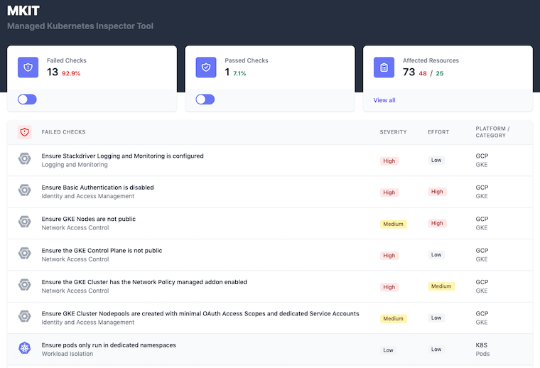

  

# MKIT - Managed Kubernetes Inspection Tool

## Evaluate key security risks of your managed Kubernetes clusters and resources

`mkit` is a "Managed [Kubernetes](https://kubernetes.io) Inspection Tool" that leverages FOSS tools to query and validate several common security-related configuration settings of managed Kubernetes cluster objects and the workloads/resources running inside the cluster.  It runs entirely from a local docker container and queries your cloud provider's APIs and the Kubernetes API to determine if certain misconfigurations are found.  The same docker container then launches a web UI to view and navigate the results on [localhost:8000](http://localhost:8000).

## Who is this for?

`mkit` provides security-minded Kubernetes cluster administrators with a quick way to assess several common misconfigurations in their Kubernetes environment.

## Which Managed Kubernetes providers are supported?

* [Azure Kubernetes Service](https://docs.microsoft.com/en-us/azure/aks/) - "AKS"
* [Amazon Elastic Kubernetes Service](https://aws.amazon.com/eks/) - "EKS"
* [Google Kubernetes Engine](https://cloud.google.com/kubernetes-engine) - "GKE"

## What if I'm running Kubernetes not on AKS, EKS, or GKE?

You can run the in-cluster Kubernetes checks by themselves.  See the steps for targeting `k8s` instead of `aks`, `eks`, or `gke`.

## What does mkit check for?

`mkit` makes use of [Chef Inspec](https://inspec.io)-formatted profiles, and they are located at the locations below:

* [https://github.com/darkbitio/inspec-profile-aks](https://github.com/darkbitio/inspec-profile-aks)
* [https://github.com/darkbitio/inspec-profile-eks](https://github.com/darkbitio/inspec-profile-eks)
* [https://github.com/darkbitio/inspec-profile-gke](https://github.com/darkbitio/inspec-profile-gke)
* [https://github.com/darkbitio/inspec-profile-k8s](https://github.com/darkbitio/inspec-profile-k8s)

## What is happening?

When running `make` with various parameters, the `mkit` tool is leveraging your cloud credentials to query the provider's APIs for the specific cluster and validating its configuration.  It then connects to the cluster directly via the Kubernetes API server to validate several configuration items inside the cluster.  Finally, it combines those results into a format viewable by the `mkit-ui` launched inside the `mkit` container listening on `localhost:8000` for viewing.

All results are stored inside the container for the life of that `mkit` run, and they are not uploaded or shared in any way.

## What does the results viewer look like?

  

## Quick Start

1. Clone this repository to your Linux/OSX/WSL2 system.
2. See the next section for building the image manually, if desired.
3. Ensure you have the permissions to `get/list/describe` your cluster via the native APIs and you have `cluster-admin` or the `view` `ClusterRole` bound to your current account.
4. Run the tool for your use case:
    1. AKS:
        * Export your Azure credentials as local environment variables (`AZURE_CLIENT_ID`, `AZURE_TENANT_ID`, `AZURE_CLIENT_SECRET`, `AZURE_SUBSCRIPTION_ID`)
        * `make run-aks resourcegroup=myResourceGroup clustername=my-aks-cluster-name`
    1. EKS:
        * `make run-eks awsregion=us-east-1 clustername=my-eks-cluster-name`
    1. GKE: 
        * Run `gcloud auth application-default login`
        * `make run-gke project_id=my-project-id location=us-central1 clustername=my-gke-cluster-name`
    1. K8s (Any Kubernetes Cluster):
        * Ensure the current context is set in your `KUBECONFIG` (`~/.kube/config`) file
        * Run `kubectl get nodes` to confirm access and the proper cluster is being targeted.
        * `make run-k8s`
5. Visit [localhost:8000](http://localhost:8000) to view the results of the scan.

Note: the `K8s` profile checks are automatically run by the `AKS`, `EKS`, and `GKE` invocations.  You would only need to run the `K8s` checks separately if you don't have access to or want to review the cluster and node configurations.

## Building the Docker image manually

1. Clone this repo
2. Modify the `Makefile` to name the image as desired
3. Run `make build` to build the container from scratch

## Customizing/Extending the checks

1. Fork the desired profile repository
2. Modify the release tag and release URL to point to your new repository/release
3. Follow the steps in the previous section to build a custom container using your new profile
