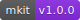
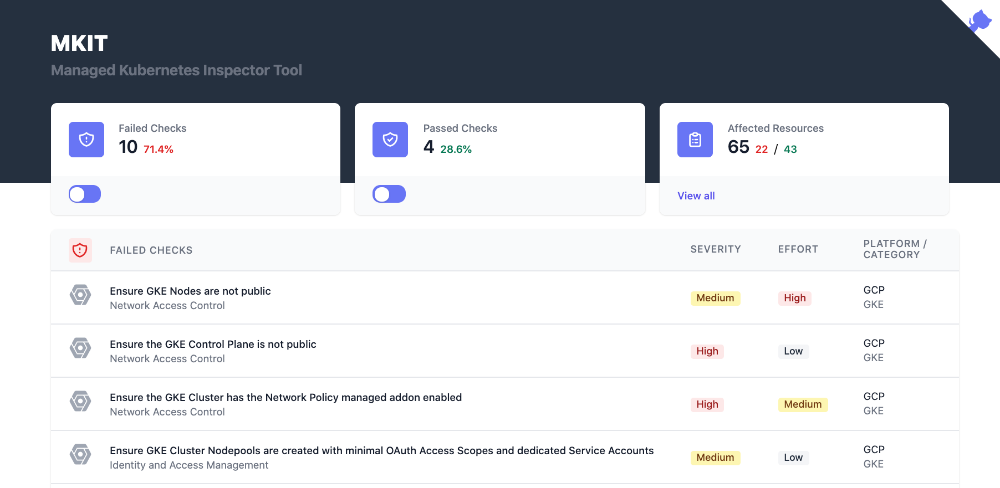
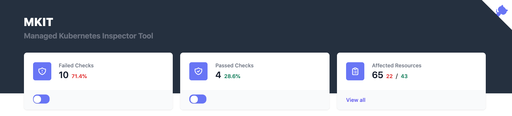

<p align="center">
  
</p>

# MKIT - Managed Kubernetes Inspection Tool



### Quickly discover key security risks of your managed Kubernetes clusters and resources

**MKIT** is a Managed [Kubernetes](https://kubernetes.io) Inspection Tool that leverages FOSS tools to query and validate several common security-related configuration settings of managed Kubernetes cluster objects and the workloads/resources running inside the cluster. It runs entirely from a local Docker container and queries your cloud provider's APIs and the Kubernetes API to determine if certain misconfigurations are found. The same Docker container then launches a web UI to view and navigate the results on [localhost:8000](http://localhost:8000).

## Demo

View a live demo of the [web UI here](https://mkit.darkbit.io/).

[](https://mkit.darkbit.io)

---

1. [Who is MKIT for?](#who-is-this-for)
1. [What does it check?](#what-does-mkit-check-for)
1. [What is it doing?](#what-does-it-do)
1. [Viewing Results](#viewing-results)
1. [Quick Start](#quick-start)
1. [Building Local](#building-local)
1. [Development](#development)

---

### Who is this for?

**MKIT** provides security-minded Kubernetes cluster administrators with a quick way to assess several common misconfigurations in their Kubernetes environment.

### Which Managed Kubernetes providers are supported?

- [Azure Kubernetes Service](#example-run-against-an-aks-cluster) (AKS)
- [Amazon Elastic Kubernetes Service](#example-run-against-an-eks-cluster) (EKS)
- [Google Kubernetes Engine](#example-run-against-a-gke-cluster) (GKE)

Note: Authenticating to AKS-Engine clusters using Azure for AD is not yet supported. For now, ensure your kubeconfig entry is generated using `az aks get-credentials`.

### What if I'm running Kubernetes not on AKS, EKS, or GKE?

You can run the in-cluster Kubernetes checks by themselves. [See the steps](#example-run-against-a-standalone-cluster) for targeting `k8s` instead of `aks`, `eks`, or `gke`.

### What does MKIT check for?

**MKIT** makes use of [Chef Inspec](https://inspec.io)-formatted profiles, and they are located at the locations below:

- [https://github.com/darkbitio/inspec-profile-aks](https://github.com/darkbitio/inspec-profile-aks)
- [https://github.com/darkbitio/inspec-profile-eks](https://github.com/darkbitio/inspec-profile-eks)
- [https://github.com/darkbitio/inspec-profile-gke](https://github.com/darkbitio/inspec-profile-gke)
- [https://github.com/darkbitio/inspec-profile-k8s](https://github.com/darkbitio/inspec-profile-k8s)

### What does it do?

When running `make` with various parameters, the **MKIT** tool is leveraging your credentials to query the cloud provider's APIs for the specific cluster and validating its configuration. It then connects to the cluster directly via the Kubernetes API server to validate several configuration items inside the cluster. Finally, it combines those results into a format viewable by the [mkit-ui](http://localhost:8000) launched inside the `mkit` container listening on [http://localhost:8000](http://localhost:8000) for viewing.

### Sensitive Data

All results are stored inside the container for the life of that **MKIT** run, and they are not uploaded or shared in any way.

## Viewing Results

The **MKIT** web UI ([http://localhost:8000](http://localhost:8000)) shows all of the results on a single page. Failed checks appear first, followed by passed checks. Clicking **view all** will show all of the underlying resources impacted by the checks and whether they **passed** or **failed**.



## Quick Start

1. Clone this repository to your Linux / macOS / WSL2 system.
2. See the [section](#building-the-docker-image-manually) on building the image manually, if desired.
3. Ensure you have the permissions to `get/list/describe` your cluster via the native APIs and you have Kubernetes `cluster-admin` or the `view` `ClusterRole` bound to your current account.
4. Run the tool for your use case:

**AKS**

Export your Azure credentials as local environment variables. The following are required:

- `AZURE_CLIENT_ID`
- `AZURE_TENANT_ID`
- `AZURE_CLIENT_SECRET`
- `AZURE_SUBSCRIPTION_ID`

Run with the **AKS** option:

```console
make run-aks resourcegroup=myResourceGroup clustername=my-aks-cluster-name
```

**EKS**

Export your AWS credentials as local environment variables. The following are required:

- `AWS_PROFILE`
- `AWS_ACCESS_KEY_ID`
- `AWS_SECRET_ACCESS_KEY`

Run with the **EKS** option:

```console
make run-eks awsregion=us-east-1 clustername=my-eks-cluster-name
```

**GKE**

Authenticate with your Google Cloud credentials

```console
gcloud auth application-default login
```

Run with the **GKE** option (be sure to specify project-id and not project-name):

```console
make run-gke project_id=my-project-id location=us-central1 clustername=my-gke-cluster-name
```

**Standalone Kubernetes**

Ensure the current context is set in your `KUBECONFIG` (`~/.kube/config`) file. Confirm access and that the proper cluster is being targeted.

```console
kubectl get nodes
```

Run with the standalone Kubernetes option.

```console
make run-k8s
```

Visit [http://localhost:8000](http://localhost:8000) to view the results of the scan.

Note: the `k8s` profile checks are automatically run by the `aks`, `eks`, and `gke` invocations. You would only need to run the `k8s` checks separately if you don't have access to or want to review the cluster and node configurations.

### Example run against an AKS cluster

```console
$ make run-aks resourcegroup=myResourceGroup clustername=aks1
```

```console
Running in darkbitio/mkit:latest: /home/node/audit/aks.sh
Generating results...[2020-03-26T22:33:45+00:00] WARN: Overwriting resource azurerm_resource. To reference a specific version of azurerm_resource use the resource() method
[2020-03-26T22:33:45+00:00] WARN: Overwriting resource azurerm_aks_cluster. To reference a specific version of azurerm_aks_cluster use the resource() method
done.
Merged "aks1" as current context in /home/node/.kube/config
Generating results...done.

Visit http://localhost:8000 to view the results
yarn run v1.22.0
node app.js


MKIT Running - browse to http://localhost:8000

```

### Example run against an EKS cluster

```console
$ make run-eks awsregion=us-east-1 clustername=eks1
```

```console
Generating results...done.
Added new context arn:aws:eks:us-east-1:1234567890:cluster/eks1 to /home/node/.kube/config
Generating results...done.

Visit http://localhost:8000 to view the results
yarn run v1.22.0
node app.js


MKIT Running - browse to http://localhost:8000

```

### Example run against a GKE cluster

```console
$ make run-gke project_id=my-gke-project location=us-central1 clustername=my-gke-cluster
```

```console
Running in darkbitio/mkit:latest: /home/node/audit/gke.sh
Generating results...done.
Fetching cluster endpoint and auth data.
kubeconfig entry generated for my-gke-cluster.
Generating results...done.

Visit http://localhost:8000 to view the results
yarn run v1.22.0
node app.js


MKIT Running - browse to http://localhost:8000

```

### Example run against a standalone cluster

Run again a standalone cluster (e.g. Docker Desktop).

```console
$ make run-k8s
```

```console
Running in darkbitio/mkit:latest: /home/node/audit/k8s.sh
Generating results...done.

Visit http://localhost:8000 to view the results
yarn run v1.22.0
node app.js


MKIT Running - browse to http://localhost:8000

```

## Building Local

If you prefer to build the Docker images locally before running, the **Dockerfile** is in this repo.

### Building the Docker image manually

1. Clone this repo
2. Modify the **Makefile** to name the image as desired
3. Run `make build` to build the container from scratch

## Development

We welcome any contributions from users in the community.

### Customizing/Extending the checks

1. Fork the desired profile repository
2. Modify the release tag and release URL to point to your new repository/release
3. Follow the steps in the previous [section](#building-the-docker-image-manually) to build a custom container using your new profile
